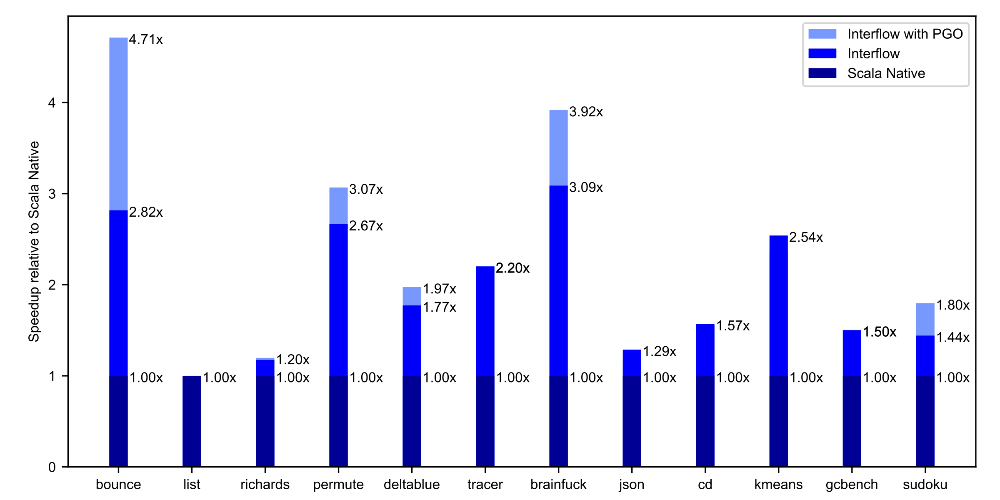
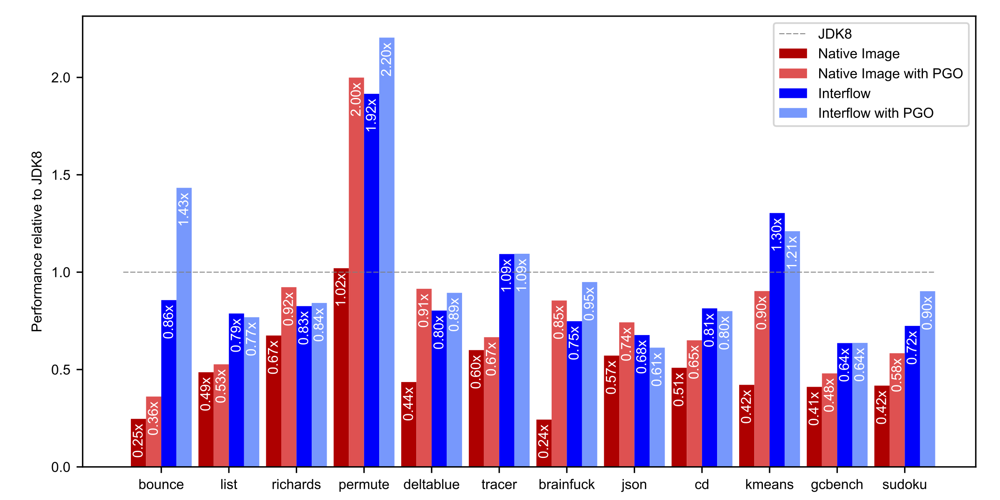

# Interflow: Scala Native's upcoming flow-sensitive, profile-guided optimizer

June 16, 2018.

This post provides a sneak peak at Interflow, an upcoming optimizer for Scala Native. For more details, see [our publication preprint](https://github.com/densh/talks/blob/master/2018-06-16-interflow-preprint-v1.pdf).

## The Interflow Optimizer

Scala Native relies on [LLVM](https://llvm.org/) as its primary optimizer as of the latest 0.3.7 release. Overall, we've found that LLVM fits this role quite well, after all, it is an industry-standard toolchain for AOT compilation of statically typed programming languages. LLVM produces high-quality native code, and the results are getting better with each release.

However, we have also found that [LLVM intermediate representation](https://llvm.org/docs/LangRef.html) is sometimes too low-level for the Scala programming language. For example, it does not have direct support for object-oriented features such as classes, allocations, virtual calls on them, instance checks, casts, etc. We encode all of those features by lowering them into equivalent code using C-like abstractions LLVM provides us. As a side effect of this lossy conversion, some of the optimization opportunities are irreversibly lost.

To address the abstraction gap between Scala's high-level features and LLVM's low-level representation, we developed our own interprocedural, flow-sensitive optimizer called Interflow. It operates on the Scala Native's intermediate representation called [NIR](http://www.scala-native.org/en/latest/contrib/nir.html). Unlike LLVM IR, it preserves full information about object-oriented features.

Interflow fuses following *static* optimizations in a single optimization pass:

* *Flow-sensitive type inference.* Interflow discards most of the original type information ascribed to the methods. Instead, we recompute it using flow-sensitive type inference starting from the entry point of the program. Type inference infers additional `exact` and `nonnull` type qualifiers which are not present in the original program. Those qualifiers aid partial evaluation in the elimination of instance checks and virtual calls.

* *Method duplication.* To propagate inferred type information across method boundaries, Interflow relies on duplication. Methods are duplicated once per unique signature, i.e., a list of inferred parameter types. Method duplication is analogous (although not strictly equivalent) to monomorphization in other languages such as C++ or Rust.

* *Partial evaluation.* As part of its traversal, Interflow partially evaluates instance checks, casts, and virtual calls away and replace them with statically predicted results. Partial evaluation removes computations that can be done at compile time and improves the precision of inferred types due to elimination of impossible control flow paths.

* *Partial escape analysis.* Interflow elides allocations which do not escape. It relies on a variation of a technique called [partial escape analysis and scalar replacement](https://dl.acm.org/citation.cfm?id=2544157). This optimization enables elimination of unnecessary closures, boxes, decorators, builders and other intermediate allocations.

* *Inlining.* Interflow performs inlining in the same pass as the rest of the optimizations. This opens the door for caller sensitive information based on partial evaluation and partial escape analysis to be taken into account to decide if method call should be inlined.

Additionally, we also add support for following *profile-guided optimizations*:

* *Polymorphic inline caching.* Interflow devirtualizes based on flow-sensitive type inference, but it can not predict all of the virtual calls. To aid static devirtualization, we also add support for dynamic devirtualization based on collected type profiles.

* *Untaken branch pruning.* Some of the application code paths (such as error handling) are rarely taken on typical workloads. Untaken branch pruning detects them based on profile data and hoists them out of a method. This optimization reduces code bloat and helps the inliner due to smaller code size left in the method.

* *Profile-directed code placement.* Using the basic block frequency LLVM optimizer can improve native code layout to have the likely branches closer together. It improves generated code quality and can have a significant performance impact on some of the workloads.

## Evaluation

**Note: the performance numbers shown here are based on the current development snapshot of the Interflow, they may change *substantially* in the final released version.**

We run our current prototype of Interflow on [Scala Native benchmarks](https://github.com/scala-native/scala-native-benchmarks) on a machine equipped with Intel i9 7900X CPU. Interflow achieves up to 3.09x higher throughput (with a geometric mean speedup of 1.8x) than Scala Native 0.3.7. Moreover, with the addition of PGO, Interflow gets up to 4.71x faster (with a geometric mean speedup 1.96x) faster than the Scala Native:

Additionally, we also compare our performance results with Graal Native Image (1.0-RC1 Enterprise Edition) and warmed up HotSpot JDK (1.8.0-1711-b11).

Both Scala Native 0.3.7 (geomean 0.49x) and Native Image 1.0-RC1 (geomean 0.47x) without PGO fail to achieve performance comparable to the a warmed-up JIT compiler. Native Image's implementation of PGO obtains impressive speedups, but it is still behind JDK8 (geomean 0.73x).

On the other hand, Interflow (geomean 0.89x) outperforms Graal Native Image statically. With the addition of PGO, Interflow gets quite close to the throughput of a fully warmed JIT compiler (geomean 0.96x).

Interestingly enough, with Interflow, profile-guided optimizations are not strictly required to get the best performance on 7 out of 12 benchmarks. PGO is just an added extra that can push last 5-10% of the performance envelope.

## Conclusion

This post provides a sneak peak at Interflow, an upcoming optimizer for Scala Native. Additionally, we're also going to provide support for profile-guided optimization as an opt-in feature for users who want to obtain absolute best peak performance for Scala Native compiled code. Interflow and PGO are currently in development. Stay tuned for updates on general availability on [twitter.com/scala_native](https://twitter.com/scala_native).
