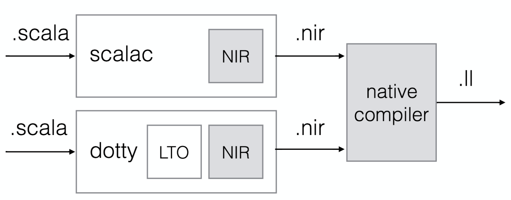

.. _compiler:

The compiler plugin and code generator
======================================

Compilation to native code happens in two steps. First, Scala code is compiled
into :ref:`nir` by nscplugin, the Scala compiler plugin. It runs as one of the
later phases of the Scala compiler and inspects the AST and generates ``.nir``
files. Finally, the ``.nir`` files are compiled into ``.ll`` files and passed
to LLVM by the native compiler.

   High-level overview of the compilation process.

Tips for working on the compiler
--------------------------------

When adding a new intrinsic, the first thing to check is how clang would compile
it in C. Write a small program with the behavior you are trying to add and
compile it to ``.ll`` using::

    clang -S -emit-llvm foo.c

Now write the equivalent Scala code for the new intrinsic in the sandbox project.
This project contains a minimal amount of code and has all the toolchain set up
which makes it fast to iterate and inspect the output of the compilation.

To compile the sandbox project run the following in the sbt shell::

    sbt> ;sandbox/clean;sandbox/nativeLink

If the example code for the new intrinsic requires you to change APIs in ``nativelib``,
then remember to also publish the changes with ``nativelib/publishLocal``.

After compiling the sandbox project you can inspect the ``.ll`` files inside
``sandbox/target/scala-<version>/ll``. The files are grouped by the package name.
By default the ``Test.scala`` file doesn't define a package, so the resulting file
will be ``__empty.ll``. Locating the code you are interested in might require that
you get more familiar with the `LLVM assembly language <http://llvm.org/docs/LangRef.html>`_.

When working on the compile plugin you'll need to publish it and reload each time
you want to recompile the sandbox project. This can be achieved with::

    sbt> ;nscplugin/publishLocal;reload;sandbox/clean;sandbox/run

Certain intrinsics might require adding new primitives to the compiler plugin.
This can be done in ``NirPrimitives`` with an accompanying definition in
``NirDefinitions``. Ensure that new primitives are correctly registered.

The NIR code generation uses a builder to maintain the generated instructions.
This allows to inspect the instructions before and after the part of the compilation
you are working on has generated code.
