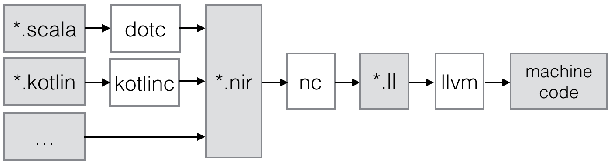

# Scala Native Design

This document provides a general technical overview of Scala Native and its
key moving parts.


## Introduction

From a very high-level point of view, the pipeline for native compilation
looks like:



1. The compilation starts by processing of the original source files
   by the front-end compiler, followed by subsequent lowering and code
   generation to [Native IR (NIR)](#native-ir-nir). Details of front-end
   code generation are not covered in this document.

1. A nirpath (equivalent of classpath for nir) of nir compilation units
   is fed to the [Native Compiler (NC)](#native-compiler-nc). Additionally,
   an entry point(s) are provided. NC computes the transitive closure of all
   classes, modules and interfaces recursively references from the specified
   entry points. Then, the result is lowered to the LLVM IR.

1. LLVM IR is compiled by the LLVM toolchain and linked with the
   [Native Runtime (NRT)](#native-runtime-nrt).

## Native Intermediate Representation (NIR)

NIR is high-level object-orriented SSA-based representation. The core of the
representation is a subset of LLVM instructions, types and values, augmented
with a number of high-level primitives that are necessary to
efficiently compiler modern languages like Scala.

### Overview

Lets have a look at the textual form of NIR generated for a simple Scala module:

```scala
package test

import System.out.println

object Test {
  def main(args: Array[String]): Unit =
    println("Hello, world!")
}
```

Would map to:

```
module test.Test_m() {
  def test.Test_m::main_string_arr_unit : (module test.Test_m, string[]) => unit {
    %2(%0 : module test.Test_m, %1 : string[]):
      %3 = field-elem[...] java.lang.System_m, java.lang.System_m::out
      %4 = load[...] %3
      %5 = method-elem[...] %4, java.io.PrintStream_c::println_string_unit
      %6 = call[...] %5(%4, "Hello, world!")
      ret %6
  }
  def test.Test_m::init : (module test.Test_m) => unit {
    %1(%0 : module test.Test_m):
      ret unit
  }
}
```

Here we can see a few major points:

1. At its core NIR is very much a classical SSA-based representation.
   The code consists of basic blocks of instructions. Instructions take
   value and type parameters. Control flow instructions can only appear
   as the last instruction of the basic block.

2. Basic blocks have parameters. Parameters directly correspond to phi instructions in the
   classical SSA.

3. The representation is strongly typed. All parameters have corresponding type
   annotations. Instructions may take type arguments (they are ommited
   here for brevity.)

4. Unlike LLVM, it has support for high-level features such as java-like
   class-based objects. Objects may contain methods and fields. There is no overloading
   or access control so names must be mangled appropriately.

### Notation

TODO

### Definitions

Low-level definitions:

1. **State**: `..$attrs var @$name: $type = $value`

   Corresponds to LLVM's [`global`](http://llvm.org/docs/LangRef.html#global-variables)
   when used in the top-level scope and to fields, when used inside classes and modules.

1. **Function declaration**: `..$attrs def @$name: $type`

   Correspond to LLVM's
   [`declare`](http://llvm.org/docs/LangRef.html#functions)
   when used on the top-level of the compilation unit and
   to abstract methods when used inside classes and interfaces.

1. **Function definition**: `..$attrs def @$name: $type { ..$blocks }`

   Corresponds to LLVM's
   [`define`](http://llvm.org/docs/LangRef.html#functions)
   when used on the top-level of the compilation unit and
   to normal methods when used inside classes, interfaces and modules.

1. **Struct**: `..$attrs struct @$name { ..$types }`

   Corresponds to LLVM's
   [`%$name = type { ... }`](http://llvm.org/docs/LangRef.html#structure-types)
   struct definition.

High-level definitions:

1. **Interface**: `..$attrs interface @$name(..$interfaces) { ..$members }`

   Java-style interfaces. May contain abstract and concrete methods as members.

1. **Class**: `..$attrs class @$name($parent, ..$interfaces) { ..$members }`

   Java-style classes. May contain state, abstract and concrete methods as members.

1. **Module**: `..$attrs module @$name($parent, ..$interfaces) { ..$members }`

   Scala-style modules (i.e. `object $name`) May contains state and concrete methods as members.

### Types

Low-level types:

1. **Void**: `void`

   Corresponds to LLVM's [`void`](http://llvm.org/docs/LangRef.html#void-type).

1. **Boolean**: `bool`

   Corresponds to LLVM's [`i1`](http://llvm.org/docs/LangRef.html#integer-type) and
   C's [`bool`](http://pubs.opengroup.org/onlinepubs/009695399/basedefs/stdbool.h.html).

1. **Integer**: `i8`, `i16`, `i32`, `i64`

   Corresponds to LLVM [integer type](http://llvm.org/docs/LangRef.html#integer-type).

1. **Floating point**: `f32`, `f64`

   Corresponds to LLVM's [floating point types](http://llvm.org/docs/LangRef.html#floating-point-types).

1. **Array value**: `[$type x N]`

   Corresponds to LLVM's [aggregate array type](http://llvm.org/docs/LangRef.html#array-type).

1. **Pointer**: `ptr $type`

   Corresponds to LLVM's [pointer type](http://llvm.org/docs/LangRef.html#pointer-type).

1. **Function**: `(..$args) => $ret`

   Corresponds to LLVM's [function type](http://llvm.org/docs/LangRef.html#function-type).

1. **Struct**: `struct @$name`

   Corresponds to LLVM's [aggregate structure type](http://llvm.org/docs/LangRef.html#structure-type).

High-level types:

1. **Size**: `size`

   Unsigned integer type of bit-depth that depends on target platform.
   Corresponds to C's [`size_t`](http://pubs.opengroup.org/onlinepubs/009695399/basedefs/stddef.h.html).

1. **Unit**: `unit`

   Corresponds to `scala.Unit`

1. **Nothing**: `nothing`

   Corresponds to `scala.Nothing`

1. **Null**: `null`

   Corresponds to `scala.Null`

1. **Built-in classes**:

    Java Class         | Built-in Type
   --------------------|---------------------
   java.lang.Object    | `object`
   java.lang.Class     | `class`
   java.lang.String    | `string`
   java.lang.Character | `character`
   java.lang.Boolean   | `boolean`
   java.lang.Byte      | `byte`
   java.lang.Short     | `short`
   java.lang.Integer   | `integer`
   java.lang.Long      | `long`
   java.lang.Float     | `float`
   java.lang.Double    | `double`

   These types are special as they have special representation
   at runtime. Most of the box types are packed into pointer value,
   without performing any allocations.

1. **Class**: `class @$name`

   A reference to class instance.

1. **Interface**: `interface @$name`

   A reference to interface instance.

1. **Module**: `module @$name`

   A reference to scala-style module.

1. **Array**: `$type[]`

   Corresponds to java-style arrays.

### Basic Blocks & Control-Flow

Low-level control-flow instructions:

1. **Unreachable**: `unreachable`

   If execution reaches undefined instruction the behaviour of execution is undefined
   starting from that point. Corresponds to LLVM's
   [`unreachable`](http://llvm.org/docs/LangRef.html#unreachable-instruction).

1. **Return**: `ret $value`

   Returns a value. Corresponds to LLVM's
   [`ret`](http://llvm.org/docs/LangRef.html#ret-instruction).

1. **Unconditional jump**: `jump $next(..$values)`

   Jumps to the next basic block with provided values for the parameters.
   Corresponds to LLVM's unconditional version of
   [`br`](http://llvm.org/docs/LangRef.html#br-instruction).

1. **Conditional jump**: `if $cond then $next1(..$values1) else $next2(..$values2)`

   Conditionally jumps to one of the basic blocks.
   Corresponds to LLVM's conditional form of
   [`br`](http://llvm.org/docs/LangRef.html#br-instruction).

1. **Switch**:
   ```
   switch $value {
      case $value1 => $next1(..$values1)
      ...
      default      => $nextN(..$valuesN)
   }
   ```
   Jumps to one of the basic blocks if `$value` matches corresponding `$valueN`.
   Corresponds to LLVM's
   [`switch`](http://llvm.org/docs/LangRef.html#switch-instruction).

1. **Invoke**: `invoke[$type] $funptr(..$values) to $success unwind $failure`
   Invoke function pointer, jump to success in case value is returned,
   unwind to failure if exception was thrown. Corresponds to LLVM's
   [`invoke`](http://llvm.org/docs/LangRef.html#invoke-instruction).

High-level control flow instructions:

1. **Throw**:`throw $value`

   Throws the values and starts unwinding.

### Operations

All non-control-flow instructions follow general pattern of
`%N = ..$attrs $op`. The value produced by the instruction may be
omitted if instruction is used purely for side-effect. Operations
follow the pattern of `$opname[..$types] ..$values`.

Low-level ops:

1. **Call**: `call[$type] $ptrvalue(..$values)`

   Calls given function of given function type and argument values.
   Corresponds to LLVM's
   [`call`](http://llvm.org/docs/LangRef.html#call-instruction).

1. **Load**: `load[$type] $ptrvalue`

   Load value of given type from memory.
   Corresponds to LLVM's
   [`load`](http://llvm.org/docs/LangRef.html#load-instruction).

1. **Store**: `store[$type] $ptrvalue, $value`

   Store value of given type to memory.
   Corresponds to LLVM's
   [`store`](http://llvm.org/docs/LangRef.html#store-instruction).

1. **Elem**: `elem[$type] $ptrvalue, ..$indexes`

   Compute derived pointer starting from given pointer value.
   Corresponds to LLVM's
   [`getelementptr`](http://llvm.org/docs/LangRef.html#getelementptr-instruction).

1. **Extract**: `extract[$type] $aggrvalue, $index`

   Extract element from aggregate value.
   Corresponds to LLVM's
   [`extractvalue`](http://llvm.org/docs/LangRef.html#extractvalue-instruction).

1. **Insert**: `insert[$type] $aggrvalue, $value, $index`

   Create a new aggregate value based on existing one with element at index replaced with new value.
   Corresponds to LLVM's
   [`insertvalue`](http://llvm.org/docs/LangRef.html#insertvalue-instruction).

1. **Alloca**: `alloca[$type]`

   Stack allocate a slot of memory big enough to store given type.
   Corresponds to LLVM's
   [`alloca`](http://llvm.org/docs/LangRef.html#alloca-instruction).

1. **Binary**: `$bin[$type] $value1, $value2`

   Where `$bin` is one of the following:
   `add`, `sub`, `mul`, `div`, `mod`, `shl`, `lshr`
   `ashr`, `and`, `or`, `xor`. Depending on the type, maps
   to either integer or floating point
   [binary operation](http://llvm.org/docs/LangRef.html#binary-operations) in LLVM.

1. **Comparison**: `$comp[$type] $value1, $value2`

   Where `$comp` is one of the following: `eq`, `neq`, `lt`, `lte`, `gt`, `gte`.
   Depending on the type, maps to either
   [`icmp`](http://llvm.org/docs/LangRef.html#icmp-instruction) or
   [`fcmp`](http://llvm.org/docs/LangRef.html#fcmp-instruction) with corresponding
   comparison flags in LLVM.

1. **Conversion**: `$conv[$type] $value`

   Where `$conv` is one of the following: `trunc`, `zext`, `sext`, `fptrunc`,
   `fpext`, `fptoui`, `fptosi`, `uitofp`, `sitofp`, `ptrtoint`, `inttoptr`, `bitcast`.
   Corresponds to LLVM
   [conversion instruction](http://llvm.org/docs/LangRef.html#conversion-operations)
   with the same name.

High-level ops:

1. **Size**: `size[$type]`

   Returns a size of given type.

1. **Allocate class**: `alloc[class @$name]`

   Roughly corresponds to `new $name` in Scala.
   Performs allocation without calling the constructor.

1. **Get pointer to field**: `field-elem[$type] $value, @$name`

   Returns a pointer to the given field of given object.

1. **Get pointer to method**: `method-elem[$type] $value, @$name`

   Returns a pointer to the given method of given object.

1. **As instance of**: `as[$type] $value`

   Corresponds to `$value.asInstanceOf[$type]` in Scala.

1. **Is instance of**: `is[$type] $value`

   Corresponds to `$value.isInstanceOf[$type]` in Scala.

1. **Allocate array**: `arr-alloc[$type] $value`

   Corresponds to `new Array[$type]($value)` in Scala.

1. **Array length**: `arr-length $value`

   Corresponds to `$value.length` in Scala.

1. **Get pointer to array element**: `arr-elem[$type] $value, $index`

   Returns a pointer to the element with given index in the array.

### Values

Low-level values:

1. **Boolean**: `true`, `false`

   Corresponds to LLVM's `true` and `false`.

1. **Zero**: `zero $type`

   Corresponds to LLVM's `zeroinitializer`.

1. **Integer**: `Ni8`, `Ni16`, `Ni32`, `Ni64`

   Correponds to LLVM's integer values.

1. **Floating point**: `N.Nf32`, `N.Nf64`

   Corresponds to LLVM's floating point values.

1. **Struct**: `struct @$name {..$values}`

   Corresponds to LLVM's struct values.

1. **Array**: `array $ty {..$values}`

   Corresponds to LLVM's array value.

1. **Local reference**: `%N`

   Named reference to result of previously executed
   instructions or basic block parameters.

1. **Global reference**: `@$name`

   Reference to the value of top-level definition.

1. **Intrinsic reference**: `#$name`

   Reference to [intrinsic](#intrinsics) definition.

High-level values:

1. **Unit value**: `unit`

   Corresponds to `()` in Scala.

1. **Null value**: `null`

   Corresponds to null literal in Scala.

1. **String value**: `"..."`

   Corresponds to string literal in Scala.

1. **Reflection class value**: `class $type`

   Corresponds to `classOf[$type]` in Scala.

### Attributes

Attributes allow one to attach additional metadata to definitions and instructions.

* **Inlinining**: `inline($advice)`

  Where `advice` is one of: `must`, `no`, `hint`
  Applicable to functions.
  Corresponds to LLVM's inlinining attributes.

* **Final**: `final`

  Applicable to classes and methods. Signifies inability to subclass or override.
  Final methods are guaranteed to not incur any virtual call overhead.

* **Override**: `override(@$name)`

  Applicable to methods.
  Must be used whenever a method overrides another one in parent class.

* **Unsigned**: `usgn`

  Used on binary operations to signify that integer values should be treated as unsigned.

### Intrinsics

Intrinsics provide a set of runtime-implemented functions. Unlike regular
FFI external definitions compiler knows about semantics of these functions and
might optimise them based on their invariants (e.g. eliminate redundant boxing,
string conversions etc)

* **Primitive boxing**:

   Name         | Signature            | Description
  --------------|----------------------|------------------------------
  `#bool_box`   | `(i1)  => boolean`   | `j.l.Boolean#valueOf`
  `#char_box`   | `(i16) => character` | `j.l.Character#valueOf`
  `#byte_box`   | `(i8)  => byte`      | `j.l.Byte#valueOf`
  `#short_box`  | `(i16) => short`     | `j.l.Short#valueOf`
  `#int_box`    | `(i32) => integer`   | `j.l.Integer#valueOf`
  `#long_box`   | `(i64) => long`      | `j.l.Long#valueOf`
  `#float_box`  | `(f32) => float`     | `j.l.Float#valueOf`
  `#double_box` | `(f64) => double`    | `j.l.Double#valueOf`

* **Primitive unboxing**:

   Name           | Signature            | Description
  ----------------|----------------------|----------------------------------
  `#bool_unbox`   | `(bool) => i1`       | `j.l.Boolean#booleanValue`
  `#char_unbox`   | `(character) => i16` | `j.l.Character#charValue`
  `#byte_unbox`   | `(byte) => i8`       | `j.l.Byte#byteValue`
  `#short_unbox`  | `(boolean) => i16`   | `j.l.Short#shortValue`
  `#int_unbox`    | `(integer) => i32`   | `j.l.Integer#intValue`
  `#long_unbox`   | `(long) => i64`      | `j.l.Long#longValue`
  `#float_unbox`  | `(float) => f32`     | `j.l.Float#floatValue`
  `#double_unbox` | `(double) => f64`    | `j.l.Double#doubleValue`

* **Primitive to string**:

   Name               | Signature         | Description
  --------------------|-------------------|-------------------------------
  `#bool_to_string`   | `(i1)  => string` | `j.l.Boolean#toString`
  `#char_to_string`   | `(i16) => string` | `j.l.Character#toString`
  `#byte_to_string`   | `(i8)  => string` | `j.l.Byte#toString`
  `#short_to_string`  | `(i16) => string` | `j.l.Short#toString`
  `#int_to_string`    | `(i32) => string` | `j.l.Integer#toString`
  `#long_to_string`   | `(i64) => string` | `j.l.Long#toString`
  `#float_to_string`  | `(f32) => string` | `j.l.Float#toString`
  `#double_to_string` | `(f64) => string` | `j.l.Double#toString`

* **Primitive from string**:

   Name              | Signature              | Description
  -------------------|------------------------|--------------------------------------------
  `#bool_parse`      | `(string) => i1`       | `j.l.Boolean#parseBoolean`
  `#byte_parse`      | `(string) => i8`       | `j.l.Byte#parseByte(String)`
  `#byte_parse_rdx`  | `(string, int) => i8`  | `j.l.Byte#parseByte(String, int)`
  `#short_parse`     | `(string) => i16`      | `j.l.Short#parseShort(String)`
  `#short_parse_rdx` | `(string, int) => i16` | `j.l.Short#parseShort(String, int)`
  `#int_parse`       | `(string) => i32`      | `j.l.Integer#parseInt(String)`
  `#int_parse_rdx`   | `(string, int) => i32` | `j.l.Integer#parseInt(String, int)`
  `#long_parse`      | `(string) => i64`      | `j.l.Long#parseLong(String)`
  `#long_parse_rdx`  | `(string, int) => i64` | `j.l.Long#parseLong(String, int)`
  `#float_parse`     | `(string) => f32`      | `j.l.Float#parseFloat(String)`
  `#double_parse`    | `(string) => f64`      | `j.l.Double#parseDouble(String, int)`

* **Primitive hash code**:

   Name               | Signature      | Description
  --------------------|----------------|-------------------------
  `#bool_hash_code`   | `(i1)  => i32` | `j.l.Boolean#hashCode`
  `#char_hash_code`   | `(i16) => i32` | `j.l.Character#hashCode`
  `#byte_hash_code`   | `(i8)  => i32` | `j.l.Byte#hashCode`
  `#short_hash_code`  | `(i16) => i32` | `j.l.Short#hashCode`
  `#int_hash_code`    | `(i32) => i32` | `j.l.Int#hashCode`
  `#long_hash_code`   | `(i64) => i32` | `j.l.Long#hashCode`
  `#float_hash_code`  | `(f32) => i32` | `j.l.Float#hashCode`
  `#double_hash_code` | `(f64) => i32` | `j.l.Double#hashCode`

* **Object**:

   Name               | Signature                | Description
  --------------------|--------------------------|-----------------------
  `#object_equals`    | `(object, object) => i1` | `j.l.Object#equals`
  `#object_to_string` | `(object) => string`     | `j.l.Object#toString`
  `#object_hash_code` | `(object) => i32`        | `j.l.Object#hashCode`
  `#object_get_class` | `(object) => class`      | `j.l.Object#getClass`

* **Class**:

   Name             | Signature           | Description
  ------------------|---------------------|---------------------
  `#class_get_name` | `(class) => string` | `j.l.Class.getName`

* **Monitor**:

   Name                 | Signature                    | Description
  ----------------------|------------------------------|-----------------------
  `#monitor_enter`      | `(object) => unit`           | start of synchronized block
  `#monitor_exit`       | `(object) => unit`           | end of synchronized block
  `#monitor_notify`     | `(object) => unit`           | `java.lang.Object#notify`
  `#monitor_notify_all` | `(object) => unit`           | `java.lang.Object#notifyAll`
  `#monitor_wait`       | `(object, i64, i32) => unit` | `java.lang.Object#wait`

* **String**:

   Name                       | Signature              | Description
  ----------------------------|------------------------|---------
  `#string_char_at`           | `(string, i32) => i16` | `java.lang.String#charAt`
  `#string_code_point_at`     | `(string, i32) => i32` | `java.lang.String#codePointAt`
  `...`                       | `...`                  | `...`

## Native Compiler (NC)

The primary role of the native compiler is to translate all high-level features from
NIR to a combination of low-level features. After that emission of LLVM code is
trivial, as all low-level constructs map cleanly on corresponding LLVM primitives.

### Assumptions

The compiler assumes the following:

1. There is no dynamic code loading of any kind.
   Definitions that are not reachable may be dropped from the resulting LLVM IR.
   Methods which have not been overriden in the reachable set of classes are effectively final.

1. Resulting LLVM module is going to be linked with Native Runtime.

### Lowering passes

1. **Array lowering**. Translates arrays and operations on them.

1. **Interface lowering**. Translates interfaces and calls on interface methods.

1. **Module lowering**. Translates modules to top-level lazy vals with corresponding
   backing module class and accessor.

1. **Intrinsic lowering**. Maps intrinsic references to corresponding runtime implementation.

1. **Void lowering**. Translates away `unit` and `nothing` types to `void`.

1. **Object lowering**. Translates user-defined, built-in classes and `null` types.

1. **Size lowering**. Translates `size` operation and `size` type.

1. **Throw lowering**. Translates away `throw` instruction.

## Native Runtime (NRT)

NRT is a C library that provide an implementation of garbage collector and intrinsics.
We assume that LLVM bitcode of the implementation is available to enable
inlining across runtime-application boundary at link time.

### Garbage Collector

* Based on
  ["Efficient On-the-Fly Cycle Collection"](http://dl.acm.org/citation.cfm?id=1255453).
  Delayed reference counting with cycle detection. Optimised for low pause times that
  are required for latency-sensitive applications.

* Precise on heap, conservative on stack.
  This allows us to have smooth handle-free interop with C code and
  not interfere with LLVM optimisations by not having to insert
  additional gc-related instructions into the compiled bitcode.

* Safe points are inserted before return from the function call and on the
  back edges of the loops. The insertion is performed by custom pass which is run
  after LLVM optimisation passes.

### Intrinsics

Intrinsics are implemented as functions with the name of intrinsic prepended by `nrt_`
prefix. Type signatures of the intrinsics are translated according to following
type correspondance rules:

 NIR Type     | C Type                 | C Convenience Alias
--------------|------------------------|----------------------
 void         | void                   | nrt_void
 bool         | bool                   | nrt_bool
 i8, ..., i64 | int8_t, ..., int64_t   | nrt_i8, ..., nrt_i64
 f32, f64     | float, double          | nrt_f32, nrt_f64
 [T x N]      | T[N]                   | n/a
 ptr T        | T*                     | n/a
 struct $name | struct $name           | n/a
 size         | size_t                 | nrt_size
 class types  | void*                  | nrt_obj

So for example `#int_box` is going to have following C signature:

```C
nrt_obj nrt_int_box(nrt_i32 value);
```

## TODO

1. Code: s/undefined/unreachable/g
1. Code: Update pretty-printer to include `@` before global names.
1. Code: Migrate to more conventional curly-brace-based syntax for NIR.
1. Code: use spaces around colon ` : `
1. Code: Parens instead of braces for struct and array values.
1. Code: Switch default
1. Code: Type.CharacterClass
1. Code: Ascribe references
1  Code: Introduce intrinsics
1. Code: More attributes
