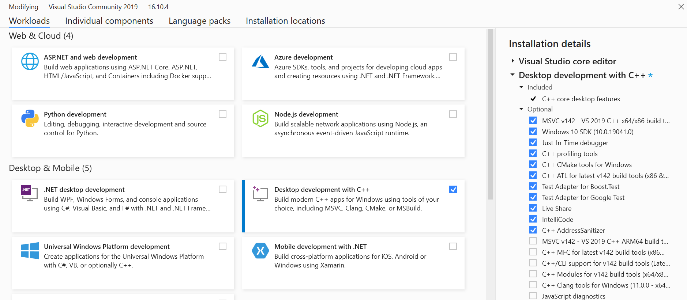

.. _setup:

Environment setup
=================

Scala Native has the following build dependencies:

* Java 8 or newer
* sbt 1.5.8 or newer
* LLVM/Clang 6.0 or newer

And following completely optional runtime library dependencies:

* Boehm GC 7.6.0 (optional)
* zlib 1.2.8 or newer (optional)

These are only required if you use the corresponding feature.

Installing sbt
--------------

**macOS, Linux, and Windows**

Please refer to `this link <https://www.scala-sbt.org/release/docs/Setup.html>`_
for instructions for your operating system.

**FreeBSD**

.. code-block:: shell

    $ pkg install sbt

Installing clang and runtime dependencies
-----------------------------------------

Scala Native requires Clang, which is part of the `LLVM`_ toolchain. The
recommended LLVM version is the most recent available for your system
provided that it works with Scala Native. The Scala Native sbt
plugin checks to ensure that `clang` is at least the minimum version
shown above.

Scala Native uses the `Immix`_ garbage collector by default.
You can use the `Boehm`_ garbage collector instead.
If you chose to use that alternate garbage collector both the native library
and header files must be provided at build time.

If you use classes from the `java.util.zip` for compression
zlib needs to be installed.

.. note::

  Some package managers provide the library header files in separate
  `-dev` packages.

Here are install instructions for a number of operating systems Scala
Native has been used with:

**macOS**

.. code-block:: shell

    $ brew install llvm
    $ brew install bdw-gc # optional

*Note 1:* Xcode should work as an alternative if preferred: 
https://apps.apple.com/us/app/xcode/id497799835

*Note 2:* A version of zlib that is sufficiently recent comes with the
installation of macOS.

**Ubuntu**

.. code-block:: shell

    $ sudo apt install clang libstdc++-12-dev
    $ sudo apt install libgc-dev # optional

**Arch Linux**

.. code-block:: shell

    $ sudo pacman -S llvm clang
    $ sudo pacman -S gc # optional

*Note:* A version of zlib that is sufficiently recent comes with the
installation of Arch Linux.

**Fedora 33**

.. code-block:: shell

    $ sudo dnf install llvm clang
    $ sudo dnf groupinstall "Development Tools"
    $ sudo dnf install gc-devel zlib-devel # both optional

**FreeBSD 12.2 and later**

.. code-block:: shell

    $ pkg install llvm10
    $ pkg install boehm-gc # optional

*Note:* A version of zlib that is sufficiently recent comes with the
installation of FreeBSD.

**Nix/NixOS**

.. code-block:: shell

    $ wget https://raw.githubusercontent.com/scala-native/scala-native/main/scripts/scala-native.nix
    $ nix-shell scala-native.nix -A clangEnv

**Windows**

Corporate environments and Windows policies can affect the method
used to setup your environment. The following procedure involves downloading
installers and running the installers using Powershell (Administrative)
to avoid some of these issues. If you have full access to your machine
then you can install using your favorite method. `Chocolatey`_ or `Scoop`_
can be substituted as needed or desired and are also mentioned above in the
installing `sbt` documentation.

1. Download and install Visual Studio Community 2019

https://visualstudio.microsoft.com/

You may install it via the command line if needed.

.. code-block:: shell

    > .\vs_community__<version>.exe

Select the *Workloads* tab and then *Desktop development with C++* checkbox.
The defaults are fine. The *C++ Clang tools for Windows* does not work so
use the next step for details on installing LLVM.

   Visual Studio install dialog showing options.

2. Download and install LLVM

https://github.com/llvm/llvm-project/releases/tag/llvmorg-12.0.1

Select *LLVM-12.0.1-win64.exe* or newer. Digital signatures are provided.

You may also install LLVM via the command line, and if needed, install it into
your *C:\\Users\\<login>\\AppData\\Local* directory. The installer
will add *LLVM* and the associated directories and files.

.. code-block:: shell

    > .\LLVM-12.0.1-win64.exe

3. Add the binary location to your PATH

Using the install path above, you would add the following:

.. code-block:: shell

    C:\Users\<login>\AppData\Local\LLVM\bin

Continue to :ref:`sbt`.

.. Comment - Sphinx linkcheck fails both http: and https://www.hboehm.info/gc 
.. Comment - so use the roughly equivalent GitHub URL.
.. _Boehm: https://github.com/ivmai/bdwgc
.. _Immix: https://www.cs.utexas.edu/users/speedway/DaCapo/papers/immix-pldi-2008.pdf
.. _LLVM: https://llvm.org
.. _Chocolatey: https://chocolatey.org/
.. _Scoop: https://scoop.sh/
.. _here: :ref:`Sbt settings and tasks`
